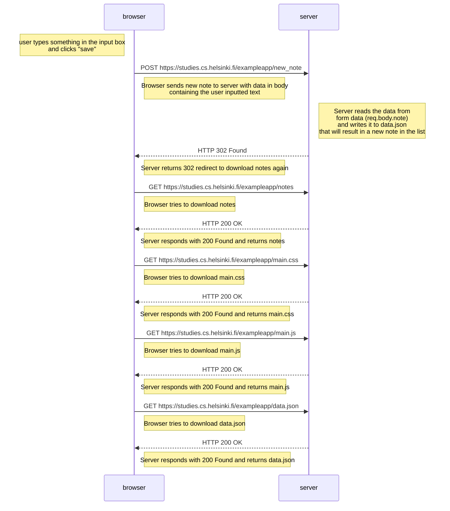

```mermaid
sequenceDiagram
    participant browser
    participant server
    Note left of browser: user types something in the input box <br> and clicks "save"
    browser->>server: POST https://studies.cs.helsinki.fi/exampleapp/new_note
    Note right of browser: Browser sends new note to server with data in body <br> containing the user inputted text
    Note right of server: Server reads the data from <br> form data (req.body.note) <br> and writes it to data.json <br> that will result in a new note in the list

    server-->>browser: HTTP 302 Found
    Note right of browser: Server returns 302 redirect to download notes again
    browser->>server: GET https://studies.cs.helsinki.fi/exampleapp/notes
    Note right of browser: Browser tries to download notes
    server-->>browser: HTTP 200 OK
    Note right of browser: Server responds with 200 Found and returns notes
    browser->>server: GET https://studies.cs.helsinki.fi/exampleapp/main.css
    Note right of browser: Browser tries to download main.css
    server-->>browser: HTTP 200 OK
    Note right of browser: Server responds with 200 Found and returns main.css
    browser->>server: GET https://studies.cs.helsinki.fi/exampleapp/main.js
    Note right of browser: Browser tries to download main.js
    server-->>browser: HTTP 200 OK
    Note right of browser: Server responds with 200 Found and returns main.js
    browser->>server: GET https://studies.cs.helsinki.fi/exampleapp/data.json
    Note right of browser: Browser tries to download data.json
    server-->>browser: HTTP 200 OK
    Note right of browser: Server responds with 200 Found and returns data.json
```
