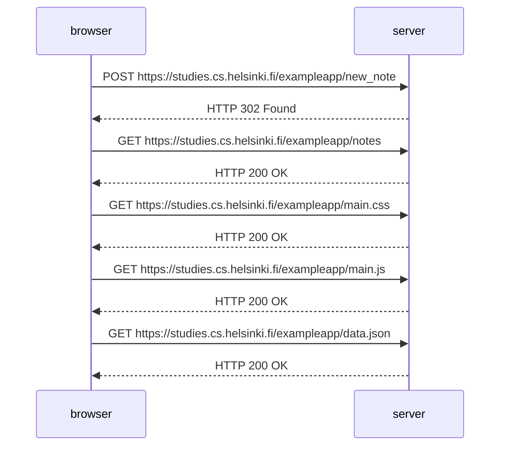

```mermaid
sequenceDiagram
    participant browser
    participant server
    browser->>server: POST https://studies.cs.helsinki.fi/exampleapp/new_note
    server-->>browser: HTTP 302 Found
    browser->>server: GET https://studies.cs.helsinki.fi/exampleapp/notes
    server-->>browser: HTTP 200 OK
    browser->>server: GET https://studies.cs.helsinki.fi/exampleapp/main.css
    server-->>browser: HTTP 200 OK
    browser->>server: GET https://studies.cs.helsinki.fi/exampleapp/main.js
    server-->>browser: HTTP 200 OK
    browser->>server: GET https://studies.cs.helsinki.fi/exampleapp/data.json
    server-->>browser: HTTP 200 OK
```
