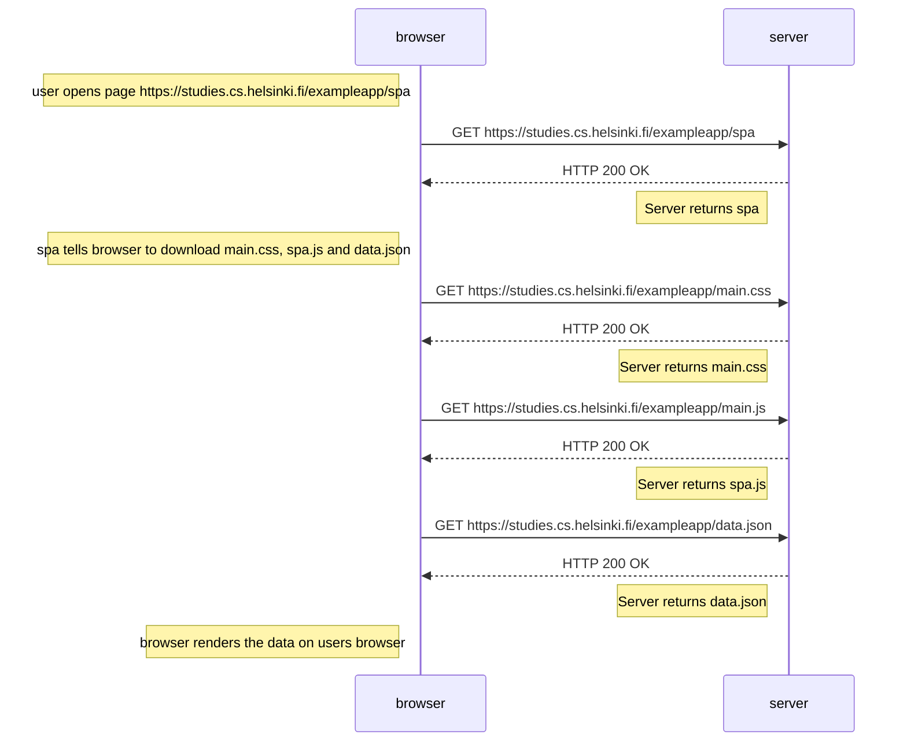

```mermaid
sequenceDiagram
    participant browser
    participant server
    Note left of browser: user opens page https://studies.cs.helsinki.fi/exampleapp/spa
    browser->>server: GET https://studies.cs.helsinki.fi/exampleapp/spa
    server-->>browser: HTTP 200 OK
    Note left of server: Server returns spa
    Note left of browser: spa tells browser to download main.css, spa.js and data.json
    browser->>server: GET https://studies.cs.helsinki.fi/exampleapp/main.css
    server-->>browser: HTTP 200 OK
    Note left of server: Server returns main.css
    browser->>server: GET https://studies.cs.helsinki.fi/exampleapp/main.js
    server-->>browser: HTTP 200 OK
    Note left of server: Server returns spa.js
    browser->>server: GET https://studies.cs.helsinki.fi/exampleapp/data.json
    server-->>browser: HTTP 200 OK
    Note left of server: Server returns data.json
    Note left of browser: browser renders the data on users browser
```
