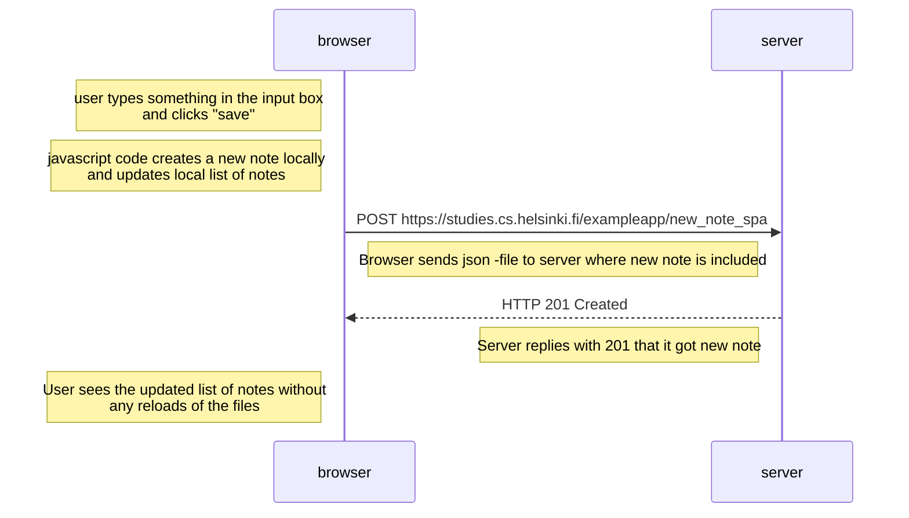

```mermaid
sequenceDiagram
    participant browser
    participant server
    Note left of browser: user types something in the input box <br> and clicks "save"
    Note left of browser: javascript code creates a new note locally <br> and updates local list of notes
    browser->>server: POST https://studies.cs.helsinki.fi/exampleapp/new_note_spa
    Note right of browser: Browser sends json -file to server where new note is included
    server-->>browser: HTTP 201 Created
    Note left of server: Server replies with 201 that it got new note
    Note left of browser: User sees the updated list of notes without <br> any reloads of the files
```
